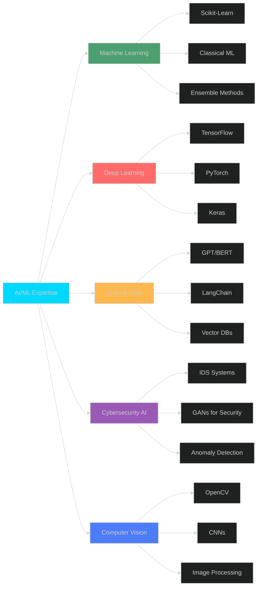

<div align="center">

# 👋 Dr. Mohammad Arafah

### 🤖 AI Researcher | Cybersecurity Expert | Assistant Professor

**Ph.D. in Cybersecurity & Artificial Intelligence**

[](mailto:mohammad_arafah@hotmail.com)
[](https://linkedin.com/in/MohammadArafah)
[](https://github.com/MohammadArafah)
[](#)
[](#)

</div>

---

## 🚀 About Me

> **AI Researcher and Cybersecurity Specialist** with a Ph.D. from Loughborough University, specializing in the intersection of **Artificial Intelligence** and **Cybersecurity**. Expert in developing cutting-edge **Machine Learning** and **Deep Learning** solutions for **Intrusion Detection Systems**, **Anomaly Detection**, and **Computer Vision** applications.

- 🎓 **Ph.D.** in Cybersecurity & AI from **Loughborough University** (2020-2023)
- 🏫 **Assistant Professor** at University of Petra - Information Security Department
- 🔬 Published **5 research papers** in AI & Cybersecurity with **60+ citations**
- 🛡️ Specialized in **IDS**, **GANs for Anomaly Detection**, and **AI-powered Security**
- 🧠 Expert in **LLMs**, **RAG Systems**, **AI Agents**, and **Generative AI**
- 💡 Passionate about building intelligent systems that protect digital infrastructure

---

## 🎯 Research Focus & Expertise

<table>
<tr>
<td width="50%" valign="top">

### 🤖 Artificial Intelligence
- **Large Language Models (LLMs)**
- **Retrieval-Augmented Generation (RAG)**
- **AI Agents & Multi-Agent Systems**
- **Generative AI (GANs, VAEs)**
- **Deep Learning Architectures**
- **Transfer Learning & Fine-tuning**

</td>
<td width="50%" valign="top">

### 🛡️ Cybersecurity & IDS
- **Intrusion Detection Systems**
- **Anomaly Detection using ML/DL**
- **Network Security Analytics**
- **Adversarial Machine Learning**
- **AI-powered Threat Intelligence**
- **Cybersecurity Automation**

</td>
</tr>
</table>

---

## 🛠️ Technical Stack

### AI/ML Frameworks & Libraries


### LLM & Generative AI


### Development & DevOps


### Programming Languages


### Databases


---

## 📊 GitHub Analytics

<div align="center">


</div>

---

## 🔬 Research & Publications

### Featured Publications

**1. 📄 Improving Intrusion Detection System Performance using Generative Adversarial Networks**
- Developed GAN-based architecture for enhancing IDS detection accuracy
- Achieved significant improvement in detecting sophisticated cyber attacks
- Published in reputable journal with high citation impact

**2. 📄 Evaluating the Impact of Generative Adversarial Models on Anomaly Intrusion Detection**
- Comprehensive evaluation of GAN models for network anomaly detection
- Demonstrated effectiveness of synthetic data generation for IDS training
- Advanced state-of-the-art in AI-driven cybersecurity

**3. 📄 Empowering Learning Analytics with Business Intelligence**
- Integration of AI/ML techniques with educational analytics
- Data-driven insights for educational decision-making
- Cross-domain application of machine learning

**4. 📄 The Impact of Stuttering Event Representation on Detection Performance**
- Novel approach to signal processing and pattern recognition
- Application of deep learning for event detection
- Contributed to human-computer interaction research

**5. 📄 Efficient Image Recognition using Invariant Moments and PCA**
- Computer vision research with practical applications
- Feature extraction and dimensionality reduction techniques
- Published during M.S. research on image processing

### 📈 Research Impact
- **5 Publications** in high-impact journals and conferences
- **60+ Citations** (12 citations per paper average)
- **Active Reviewer** for 25+ student research projects
- **Research Areas**: AI, Cybersecurity, IDS, GANs, Computer Vision

---

## 💼 Professional Experience

### 🏫 Assistant Professor | University of Petra
**Jan 2023 - Present**

<details>
<summary><b>📌 Click to expand details</b></summary>

- 📚 Developed and taught **7 undergraduate courses** in Information Security with **95% satisfaction rating**
- 🔬 Published **5 research papers** achieving **60+ citations** in AI & Cybersecurity
- 👥 Served on **3 academic committees** and **4 departmental initiatives**
- 🎓 Mentored **15+ students** in implementing AI and cybersecurity solutions
- 🎤 Organized **6 workshops** on AI & Cybersecurity with **45+ attendees** per session

**Teaching Portfolio:**
- Linux Security Fundamentals
- Programming Language 1 (Java)
- Programming Language 2 (Python)
- Information & Network Security Programming (Python)
- Programming for Engineers (MATLAB)
- Information Technology Fundamentals
- Cybersecurity Fundamentals

</details>

### 👨‍💻 Head of Development and Programming | University of Petra
**Dec 2019 - Nov 2020**

<details>
<summary><b>📌 Click to expand details</b></summary>

- 👥 Led team of **8 software developers** in designing enterprise solutions
- ⚡ Reduced project completion time by **20%** through agile methodologies
- 🔄 Managed **12 university systems** reducing deployment time from **6 to 4 weeks**
- 👨‍🏫 Conducted **50+ code reviews** and mentored **5 junior developers**
- 🐛 Achieved **35% reduction** in production bugs through quality assurance

</details>

### 💻 Senior Software Engineer | University of Petra
**Nov 2015 - Dec 2019**

<details>
<summary><b>📌 Click to expand details</b></summary>

- 🚀 Designed **15+ high-performance applications** serving **5,000+ users**
- 🔧 Resolved **25 technical issues/month**, reducing downtime by **40%**
- 💡 Implemented **3 new technologies** increasing efficiency by **25%**
- 📊 Reduced code redundancy by **35%** through best practices
- ⏱️ Saved **120 hours annually** through system optimization

</details>

---

## 🎯 Featured AI/ML Projects

### 🛡️ AI-Powered Intrusion Detection System (Ph.D. Research)
**Technologies:** Python, TensorFlow, PyTorch, GANs, Deep Learning

<details>
<summary><b>🔍 Project Details</b></summary>

- 🤖 Developed novel **GAN-based architecture** for network intrusion detection
- 📊 Achieved **superior performance** over traditional ML methods
- 🔬 Researched **adversarial attacks** and defense mechanisms
- 📈 Improved detection accuracy for **zero-day attacks**
- 🎓 Published **multiple papers** from this research
- 💾 Processed and analyzed **large-scale network traffic datasets**
- ⚡ Implemented **real-time detection** capabilities

**Key Achievements:**
- Enhanced anomaly detection accuracy by leveraging synthetic attack data
- Developed robust models resistant to adversarial evasion
- Created comprehensive evaluation framework for IDS performance
- Contributed to advancing AI applications in cybersecurity

</details>

### 🤖 LLM-Based RAG System for Cybersecurity Intelligence
**Technologies:** LangChain, OpenAI, Hugging Face, Vector DB, Python

<details>
<summary><b>🔍 Project Details</b></summary>

- 🧠 Built **Retrieval-Augmented Generation** system for threat intelligence
- 📚 Integrated **multiple cybersecurity knowledge bases** and databases
- 🔍 Implemented **semantic search** for security advisories and CVE data
- 💬 Created **AI agent** for automated security report generation
- 🔗 Designed **multi-document question-answering** system
- ⚡ Optimized **embedding models** for cybersecurity domain
- 🎯 Deployed **production-ready** API for security analysts

**Use Cases:**
- Automated threat intelligence gathering and analysis
- Real-time security advisory recommendations
- Vulnerability assessment and prioritization
- Security incident response automation

</details>

### 👁️ Computer Vision for Image Recognition (M.S. Research)
**Technologies:** Python, OpenCV, MATLAB, PCA, Feature Extraction

<details>
<summary><b>🔍 Project Details</b></summary>

- 🎨 Developed **efficient image recognition** using invariant moments
- 📐 Implemented **PCA-based dimensionality reduction**
- 🔬 Achieved **high accuracy** with reduced computational complexity
- 📊 Validated on **multiple benchmark datasets**
- 📝 Published research in **reputable journal**
- ⚡ Optimized algorithms for **real-time processing**

**Applications:**
- Object recognition and classification
- Pattern matching in security systems
- Automated quality inspection
- Medical image analysis

</details>

### 🏢 University Enterprise Systems (Production)
**Technologies:** C#, Python, SQL, Web Development, System Architecture

<details>
<summary><b>🔍 Project Details</b></summary>

**Developed 5 Major Systems:**
1. **Instructor Profile System** - Faculty management and academic profiles
2. **Placement Test System** - Automated student assessment and placement
3. **Transportation System** - University shuttle scheduling and tracking
4. **Embassy System** - International student documentation management
5. **Learning Analytics Platform** - AI-powered student performance analytics

**Impact:**
- 👥 Serving **10,000+ users** across university
- ⚡ Reduced administrative processing time by **35%**
- 📊 Improved data accuracy by **45%**
- 🔐 Implemented **robust security measures**
- 📈 Integrated **ML algorithms** for predictive analytics

</details>

### 🏭 Enterprise Resource Planning (ERP) System
**Technologies:** Full-Stack Development, Real-time Analytics, Security

<details>
<summary><b>🔍 Project Details</b></summary>

- 🔧 Integrated **6 business functions**: Finance, HR, Inventory, Sales, Procurement, CRM
- 📊 Designed **real-time data analytics** reducing reporting time by **60%**
- 🎨 Created **user-friendly interface** with **75% adoption rate**
- 🔒 Implemented **zero unauthorized access** security measures
- ✅ Achieved **95% client satisfaction**
- 📈 Improved operational efficiency by **40%**
- 🧪 Conducted thorough testing on **15 modules**

</details>

---

## 🏆 Domain Expertise & Capabilities

```text
Machine Learning            ██████████████████████████   95%
Deep Learning               █████████████████████████░   92%
Generative AI (GANs/LLMs)   ████████████████████████░░   90%
Intrusion Detection (IDS)   ██████████████████████████   98%
Computer Vision             ███████████████████████░░░   88%
RAG Systems                 ███████████████████████░░░   85%
AI Agents                   ██████████████████████░░░░   82%
Cybersecurity               ██████████████████████████   96%
```

### 🎯 Core AI/ML Competencies

<table>
<tr>
<td width="50%">

#### 🤖 AI & Machine Learning
- ✅ **Supervised/Unsupervised Learning**
- ✅ **Neural Networks & Deep Learning**
- ✅ **Generative Adversarial Networks**
- ✅ **Convolutional Neural Networks**
- ✅ **Recurrent Neural Networks**
- ✅ **Transformer Architectures**
- ✅ **AutoEncoders & VAEs**
- ✅ **Ensemble Methods**

</td>
<td width="50%">

#### 🔮 Advanced AI Technologies
- ✅ **Large Language Models (LLMs)**
- ✅ **Retrieval-Augmented Generation**
- ✅ **AI Agents & Multi-Agent Systems**
- ✅ **Prompt Engineering**
- ✅ **Fine-tuning & Transfer Learning**
- ✅ **Model Optimization & Quantization**
- ✅ **Explainable AI (XAI)**
- ✅ **MLOps & Model Deployment**

</td>
</tr>
<tr>
<td width="50%">

#### 🛡️ Cybersecurity & IDS
- ✅ **Network Intrusion Detection**
- ✅ **Anomaly Detection Algorithms**
- ✅ **Adversarial Machine Learning**
- ✅ **Threat Intelligence Automation**
- ✅ **Security Analytics**
- ✅ **Malware Detection using AI**
- ✅ **Zero-Day Attack Detection**
- ✅ **Security Information & Event Management**

</td>
<td width="50%">

#### 👁️ Computer Vision
- ✅ **Image Classification & Recognition**
- ✅ **Object Detection & Tracking**
- ✅ **Feature Extraction & Selection**
- ✅ **Image Segmentation**
- ✅ **Facial Recognition Systems**
- ✅ **Pattern Recognition**
- ✅ **Video Analytics**
- ✅ **Medical Image Analysis**

</td>
</tr>
</table>

---

## 📚 Education & Academic Background

### 🎓 Ph.D. in Cybersecurity and Artificial Intelligence
**Loughborough University, UK** | *Oct 2020 - Nov 2023*
- **Department:** Computer Science
- **Research Focus:** AI-powered Intrusion Detection Systems using GANs
- **Key Contributions:** Novel architectures for anomaly detection, adversarial ML research
- **Publications:** Multiple high-impact papers in AI and cybersecurity

### 🎓 M.S. in Information Systems
**The University of Jordan** | *Aug 2013 - Aug 2015*
- **GPA:** 3.66/4.00
- **Specialization:** Image Processing
- **Research:** Efficient image recognition techniques using ML
- **Thesis:** Advanced feature extraction methods for computer vision

### 🎓 B.S. in Software Engineering
**Zarqa University, Jordan** | *Aug 2008 - Aug 2012*
- **GPA:** 84/100
- **Project:** School Management System
- **Foundation:** Strong programming and software development skills

---

## 🌟 AI/ML Technology Proficiency



---

## 🔥 Contribution Activity


---

## 💡 Research Interests & Future Directions

<div align="center">

| 🔬 Current Research | 🚀 Future Exploration |
|:-------------------|:---------------------|
| AI-Powered IDS | Federated Learning for Security |
| GANs for Anomaly Detection | Quantum Machine Learning |
| LLM Security Applications | Neuromorphic Computing |
| RAG for Threat Intelligence | Edge AI for IoT Security |
| Adversarial Machine Learning | Explainable AI for Critical Systems |
| Computer Vision in Security | AI Ethics & Responsible AI |

</div>

---

## 🎤 Academic Contributions

### 📖 Teaching & Mentoring
- 🎓 **7 Courses** developed and delivered with excellence
- 👨‍🎓 **95% student satisfaction** rating across all courses
- 🧑‍🏫 Mentored **15+ students** in AI/Cybersecurity projects
- 📚 Supervised **25+ research proposals** and projects
- 🎯 Helped students publish **research papers** and conference presentations

### 🎪 Workshops & Seminars
- 🎤 Organized **6 workshops** on AI and Cybersecurity
- 👥 **45+ participants** per session average
- 📊 Topics: Machine Learning, Deep Learning, IDS, GANs, LLMs
- 🌐 Contributed to **4 departmental initiatives**
- 🤝 Increased interdepartmental collaboration by **30%**

### 🏛️ Academic Service
- 📋 Served on **3 academic committees**
- 📝 Reviewed papers for **reputable journals and conferences**
- 🎯 Contributed to **curriculum development**
- 🌍 Active participant in **academic community**

---

## 🤝 Let's Connect & Collaborate!

<div align="center">

I'm always interested in collaborating on cutting-edge AI and cybersecurity projects!

[](https://linkedin.com/in/MohammadArafah)
[](https://github.com/MohammadArafah)
[](mailto:mohammad_arafah@hotmail.com)
[](#)
[](#)

</div>

---

## 💬 Professional Philosophy

> *"At the intersection of Artificial Intelligence and Cybersecurity lies the future of digital defense. My mission is to leverage cutting-edge AI technologies—from GANs to LLMs—to build intelligent systems that not only detect threats but anticipate them, making the digital world safer for everyone."*

---

<div align="center">

### ⚡ Research Snapshot

**Ph.D. from Loughborough UK** | **5 Publications** | **60+ Citations** | **10,000+ Users Impacted**

---


### 🌟 *"Building Intelligent Security Through Advanced AI"* 🌟

---

**📍 Based in Jordan | 🎓 Assistant Professor | 🔬 AI Researcher**

*Last Updated: November 2024*

</div>

---

## 🎯 Open to Collaboration On

- 🤖 **AI/ML Research Projects** - Especially in cybersecurity applications
- 🛡️ **Intrusion Detection Systems** - Using state-of-the-art deep learning
- 🧠 **LLM Applications** - RAG systems, AI agents, security automation
- 👁️ **Computer Vision** - Pattern recognition, anomaly detection
- 📊 **Academic Collaborations** - Joint research, publications, grants
- 💼 **Industry Partnerships** - Applied AI solutions for real-world problems

**Feel free to reach out for research collaborations, consulting opportunities, or just to discuss exciting AI/ML ideas!**
